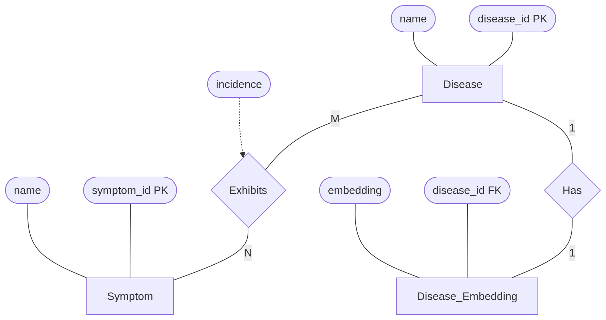
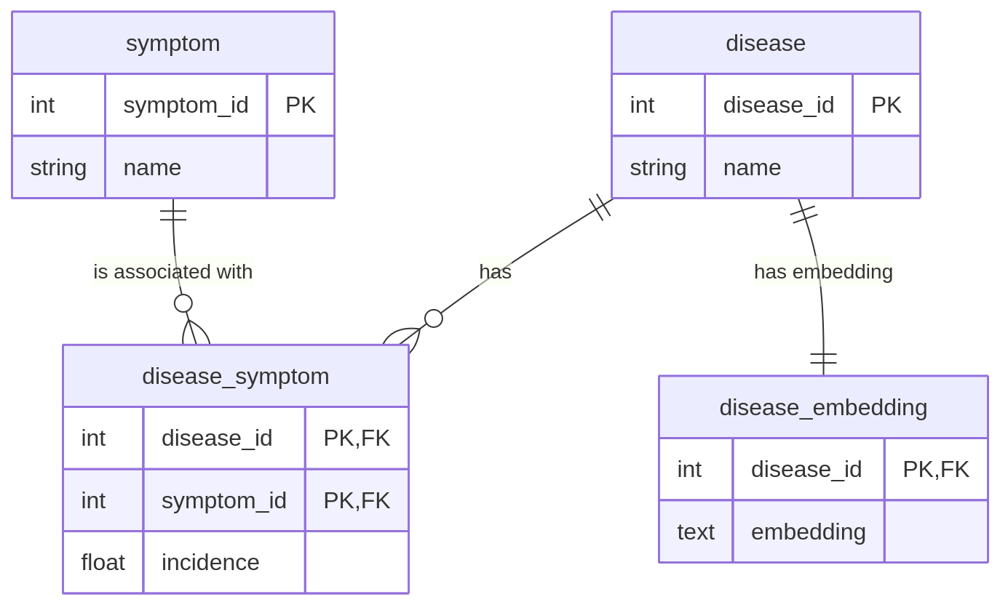

# Laboratório 6

Este laboratório trabalha com o conceito de Bancos de Dados Vetoriais, um tema bastante recente que tem fortes relações com abordagens modernas de aprendizagem de máquina. No laboratório será usado um cenário de sintomas e doenças, apropriado para a construção de buscas aproximadas.

O laboratório partirá deste artigo, que construiu um grafo de conhecimento que relaciona sintomas e doenças, bem como o peso da importância de cada sintoma na doença:

Rotmensch, M., Halpern, Y., Tlimat, A., Horng, S., & Sontag, D. (2017). Learning a Health Knowledge Graph from Electronic Medical Records. Scientific Reports 2017 7:1, 7(1), 1–11. https://doi.org/10.1038/s41598-017-05778-z

A partir deste estudo, foi publicada no GitHub uma tabela das arestas do grafo relacionando as doenças e seus sintomas:

https://github.com/clinicalml/HealthKnowledgeGraph/blob/master/DerivedKnowledgeGraph_final.csv

Para este laboratório, os dados deste arquivo foram extraídos e inseridos em um banco de dados vetorial chamado DuckDB, com o seguinte esquema:

<code>

disease (<u>disease_id</u>, name)

symptom(<u>symptom_id</u>, name)

disease_symptom(<u>disease_id</u>, <u>symptom_id</u>, incidence)
* `disease_id` is FK to disease
* `symptom_id` is FK to symptom

disease_embedding(<u>disease_id</u>, embedding)
* `disease_id` is FK to disease

</code>

[](https://mermaid.live/edit#pako:eNp1UtuOmzAQ_RXL0kpUCpFhSyA8VKoKVaVetfSpsIocPAGrsYmwaTcl-fcaElinFx5GzBmfMzPH7nHZMMAx3u2bn2VNW42-JoVE5ru7Q6nUXHNQyHmAUlNZ7UG9uFSTPOEKqILHS57l2VEcdCOueTrVN6nYAmNcVqYyKz_AnmreSFXzg5FPOBWNZLN41qdPNd9yrc5XJO3f0SG5ne3o2kLoA5ff1ZWAXNc9fTwZrUlzRD6dUGaf8MyJdOoxIanV57XWLd92enDh8w-6n2ZkG86cnF2X5Ax9ef84lyQV4ORDnLBLVCNJXZy6Jan_kuDPTm9nEmxAbJ0cZotviFyWTm4CZyDLUfTvrWzPhpUGC1Bi72Ejz1uMaGaPbiPPg49oak1rA_98Dpbj8xrIXbqvxqvEC1y1nOFYtx0ssIBW0CHF_XC4wLoGAQWOzS-DHe32usCFPBvagcpvTSMmZtt0VY3jnblRk3UHRjWYZ1i1VMxoC5JB-6bppMaxtyajCI57_IRjP1xG_n0QrsMo8klESLTARxwHL5f3KxKuiR_4qygIgvMC_xrbkmW08ohHAhKEPgk9Pzz_BuT8C4U)

Este laboratório necessita que você saiba como funcionam modelos de linguagem e o que são embeddings. Se você não sabe, recomendo que assista aos vídeos de fundamentos antes do de bancos de dados vetoriais.

## Fundamentos

Os fundamentos estão organizados em vídeos de uma disciplina que ministrei sobre Processamento de Linguagem Natural em Engenharia de Software e que estão nesta playlist:
<iframe width="560" height="315" src="https://www.youtube.com/embed/videoseries?si=a59FDTGxAT9qKy0E&amp;list=PL3JRjVnXiTBav-3wzOLAUIXcssKBt2o51" title="YouTube video player" frameborder="0" allow="accelerometer; autoplay; clipboard-write; encrypted-media; gyroscope; picture-in-picture; web-share" referrerpolicy="strict-origin-when-cross-origin" allowfullscreen></iframe>

### Language Models, Semântica de Vetores e Embedding
Este vídeo tem os fundamentos mínimos necessários para você entender um banco de dados vetorial.
<iframe width="560" height="315" src="https://www.youtube.com/embed/8D_u_kpF7Jw?si=xyiVde7kjKrzOp6a" title="YouTube video player" frameborder="0" allow="accelerometer; autoplay; clipboard-write; encrypted-media; gyroscope; picture-in-picture; web-share" referrerpolicy="strict-origin-when-cross-origin" allowfullscreen></iframe>

### Transformers, Encoders e Universo dos Embeddings
Este vídeo explica a arquitetura Transformers e como os embeddings são criados. Ele dá uma visão mais precisa de como os embeddings são criados e a sua relação com os modelos de linguagem.
<iframe width="560" height="315" src="https://www.youtube.com/embed/QGi4iXhVomI?si=GwvMPMd1HScjDlKO" title="YouTube video player" frameborder="0" allow="accelerometer; autoplay; clipboard-write; encrypted-media; gyroscope; picture-in-picture; web-share" referrerpolicy="strict-origin-when-cross-origin" allowfullscreen></iframe>

### Clusterização a partir de Encoders e uso de NER
Este vídeo mostra como os embeddings são usados para medir distâncias e encontrar coisas similares.
<iframe width="560" height="315" src="https://www.youtube.com/embed/oDb-7JM-fck?si=CvCWhzrqDnvwV6a6" title="YouTube video player" frameborder="0" allow="accelerometer; autoplay; clipboard-write; encrypted-media; gyroscope; picture-in-picture; web-share" referrerpolicy="strict-origin-when-cross-origin" allowfullscreen></iframe>

## Bancos de Dados Vetoriais e DuckDB

Para entender o que é um banco de dados vetorial e como funciona o DuckDB, você deve assistir a este vídeo:

<iframe width="560" height="315" src="https://www.youtube.com/embed/4n26QMxeA38?si=TxdEcPti0MDkb11T" title="YouTube video player" frameborder="0" allow="accelerometer; autoplay; clipboard-write; encrypted-media; gyroscope; picture-in-picture; web-share" referrerpolicy="strict-origin-when-cross-origin" allowfullscreen></iframe>

Após assistir aos vídeos, estude as queries [deste arquivo](https://huggingface.co/spaces/santanche/medical-vector-space/blob/main/examples/README.md).

Construa queries SQL para atender às demandas a seguir. Você pode reutilizar as queries fornecidas como exemplo, mas não pode usar os mesmos exemplos de sintomas/doenças. Para cada solicitação, você deve colocar a query e a saída produzida em JSON na interface disponível [aqui](https://huggingface.co/spaces/santanche/medical-vector-space). As respostas devem ser inseridas no documento do Google Docs compartilhado no Classroom.

1) Escolha duas doenças do banco muito diferentes entre si e calcule a sua similaridade.
2) Escolha duas doenças do banco muito similares entre si e calcule a sua similaridade.
3) Escolha uma lista de sintomas e mostre doenças candidatas que apresentam estes sintomas, ranqueadas por relevância.
4) Escolha uma das que você usou no item (2) e liste as doenças similares a ela, ranqueadas por similaridade.
5) Proponha um problema interessante para ser resolvido com um banco de dados vetorial e apresente uma query para este problema.

